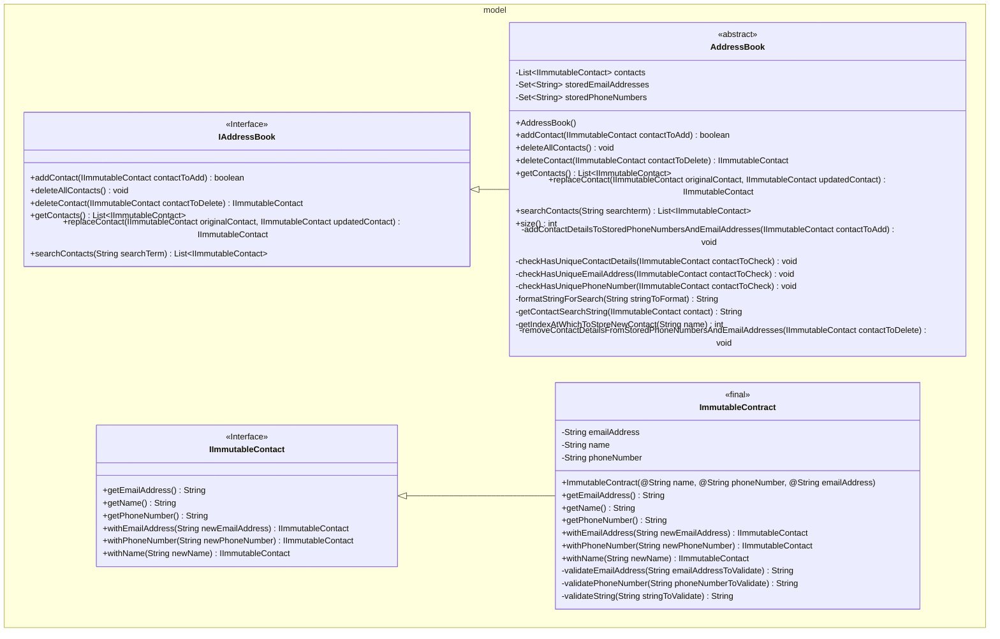
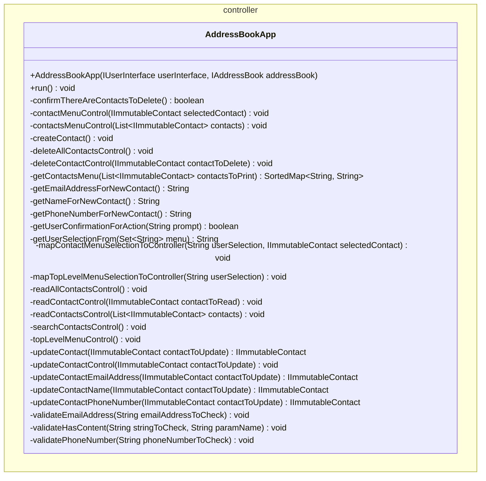
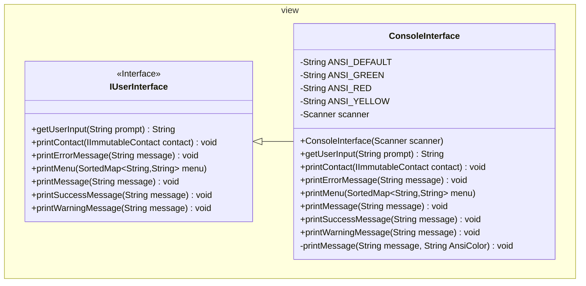
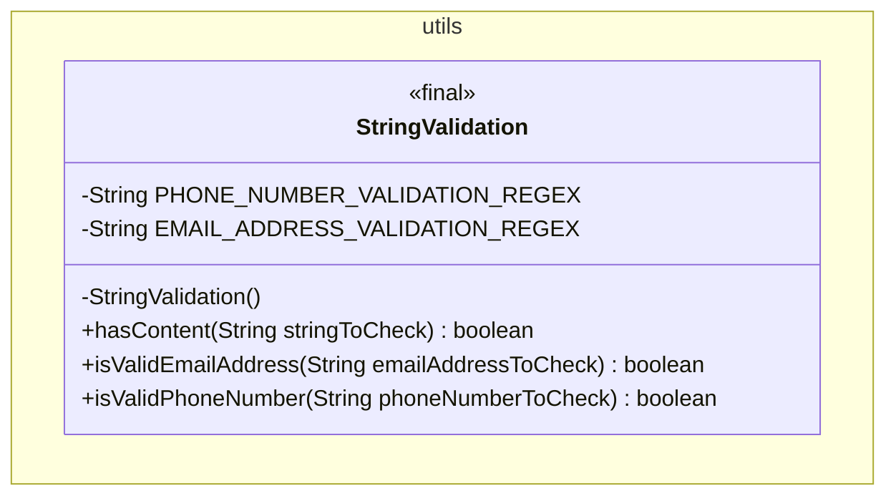

```mermaid
classDiagram
    namespace model {
        class IAddressBook {
            <<Interface>>
            +addContact(IImmutableContact contactToAdd) boolean
            +deleteAllContacts() void
            +deleteContact(IImmutableContact contactToDelete) IImmutableContact
            +getContacts() List~IImmutableContact~
            +replaceContact(IImmutableContact originalContact, IImmutableContact updatedContact) IImmutableContact
            +searchContacts(String searchTerm) List~IImmutableContact~
        }
        class AddressBook {
            <<abstract>>
            -List~IImmutableContact~ contacts
            -Set~String~ storedEmailAddresses
            -Set~String~ storedPhoneNumbers
            +AddressBook()
            +addContact(IImmutableContact contactToAdd) boolean
            +deleteAllContacts() void
            +deleteContact(IImmutableContact contactToDelete) IImmutableContact
            +getContacts() List~IImmutableContact~
            +replaceContact(IImmutableContact originalContact, IImmutableContact updatedContact) IImmutableContact
            +searchContacts(String searchterm) List~IImmutableContact~
            +size() int
            -addContactDetailsToStoredPhoneNumbersAndEmailAddresses(IImmutableContact contactToAdd) void
            -checkHasUniqueContactDetails(IImmutableContact contactToCheck) void
            -checkHasUniqueEmailAddress(IImmutableContact contactToCheck) void
            -checkHasUniquePhoneNumber(IImmutableContact contactToCheck) void
            -formatStringForSearch(String stringToFormat) String
            -getContactSearchString(IImmutableContact contact) String
            -getIndexAtWhichToStoreNewContact(String name) int
            -removeContactDetailsFromStoredPhoneNumbersAndEmailAddresses(IImmutableContact contactToDelete) void
        }
        class IImmutableContact {
            <<Interface>>
            +getEmailAddress() String
            +getName() String
            +getPhoneNumber() String
            +withEmailAddress(String newEmailAddress) IImmutableContact
            +withPhoneNumber(String newPhoneNumber) IImmutableContact
            +withName(String newName) IImmutableContact
        }
        class ImmutableContract {
            <<final>>
            -String emailAddress
            -String name
            -String phoneNumber
            +ImmutableContract(@String name, @String phoneNumber, @String emailAddress)
            +getEmailAddress() String
            +getName() String
            +getPhoneNumber() String
            +withEmailAddress(String newEmailAddress) IImmutableContact
            +withPhoneNumber(String newPhoneNumber) IImmutableContact
            +withName(String newName) IImmutableContact
            -validateEmailAddress(String emailAddressToValidate) String
            -validatePhoneNumber(String phoneNumberToValidate) String
            -validateString(String stringToValidate) String
        }
    }
    IAddressBook <|-- AddressBook
    IImmutableContact <|-- ImmutableContract
```

```mermaid
classDiagram
     namespace controller {
        class AddressBookApp{
            +AddressBookApp(IUserInterface userInterface, IAddressBook addressBook)
            +run() void
            -confirmThereAreContactsToDelete() boolean
            -contactMenuControl(IImmutableContact selectedContact) void
            -contactsMenuControl(List~IImmutableContact~ contacts) void
            -createContact() void
            -deleteAllContactsControl() void
            -deleteContactControl(IImmutableContact contactToDelete) void
            -getContactsMenu(List~IImmutableContact~ contactsToPrint) SortedMap~String, String~
            -getEmailAddressForNewContact() String
            -getNameForNewContact() String
            -getPhoneNumberForNewContact() String
            -getUserConfirmationForAction(String prompt) boolean
            -getUserSelectionFrom(Set~String~ menu) String
            -mapContactMenuSelectionToController(String userSelection, IImmutableContact selectedContact) void
            -mapTopLevelMenuSelectionToController(String userSelection) void
            -readAllContactsControl() void
            -readContactControl(IImmutableContact contactToRead) void
            -readContactsControl(List~IImmutableContact~ contacts) void
            -searchContactsControl() void
            -topLevelMenuControl() void
            -updateContact(IImmutableContact contactToUpdate) IImmutableContact
            -updateContactControl(IImmutableContact contactToUpdate) void
            -updateContactEmailAddress(IImmutableContact contactToUpdate) IImmutableContact
            -updateContactName(IImmutableContact contactToUpdate) IImmutableContact
            -updateContactPhoneNumber(IImmutableContact contactToUpdate) IImmutableContact
            -validateEmailAddress(String emailAddressToCheck) void
            -validateHasContent(String stringToCheck, String paramName) void
            -validatePhoneNumber(String phoneNumberToCheck) void
        }
    }
```

```mermaid
classDiagram
     namespace view {
        class IUserInterface {
            <<Interface>>
            +getUserInput(String prompt) String
            +printContact(IImmutableContact contact) void
            +printErrorMessage(String message) void
            +printMenu(SortedMap~String,String~ menu)
            +printMessage(String message) void
            +printSuccessMessage(String message) void
            +printWarningMessage(String message) void
        }

        class ConsoleInterface{
            -String ANSI_DEFAULT
            -String ANSI_GREEN
            -String ANSI_RED
            -String ANSI_YELLOW
            -Scanner scanner
            +ConsoleInterface(Scanner scanner)
            +getUserInput(String prompt) String
            +printContact(IImmutableContact contact) void
            +printErrorMessage(String message) void
            +printMenu(SortedMap~String,String~ menu)
            +printMessage(String message) void
            +printSuccessMessage(String message) void
            +printWarningMessage(String message) void
            -printMessage(String message, String AnsiColor) void
        }
    }
    IUserInterface <|-- ConsoleInterface
```

```mermaid
classDiagram
    namespace utils {
    class StringValidation{
        <<final>>
        -String PHONE_NUMBER_VALIDATION_REGEX
        -String EMAIL_ADDRESS_VALIDATION_REGEX
        -StringValidation()
        +hasContent(String stringToCheck) boolean
        +isValidEmailAddress(String emailAddressToCheck) boolean
        +isValidPhoneNumber(String phoneNumberToCheck) boolean
    }
}
```