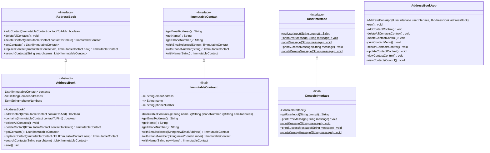

```mermaid
classDiagram
    class IAddressBook {
        <<Interface>>
        +addContact(IImmutableContact contactToAdd) boolean
        +deleteAllContacts() void
        +deleteContact(IImmutableContact contactToDelete) IImmutableContact
        +getContacts() List~IImmutableContact~
        +replaceContact(IImmutableContact old, IImmutableContact new) IImmutableContact
        +searchContacts(String searchterm) List~IImmutableContact~
    }
    class AddressBook {
        <<abstract>>
        -List~IImmutableContact~ contacts
        -Set~String~ emailAddresses
        -Set~String~ phoneNumbers
        +AddressBook()
        +addContact(IImmutableContact contactToAdd) boolean
        +contains(IImmutableContact contactToFind) boolean
        +deleteAllContacts() void
        +deleteContact(IImmutableContact contactToDelete) IImmutableContact
        +getContacts() List~IImmutableContact~
        +replaceContact(IImmutableContact old, IImmutableContact new) IImmutableContact
        +searchContacts(String searchterm) List~IImmutableContact~
        +size() int
    }
    IAddressBook <|-- AddressBook
    
    class IImmutableContact {
        <<Interface>>
        +getEmailAddress() String
        +getName() String
        +getPhoneNumber() String
        +withEmailAddress(String) IImmutableContact
        +withPhoneNumber(String) IImmutableContact
        +withName(String) IImmutableContact
    }
    class ImmutableContract {
        <<final>>
        -<<final>> String emailAddress
        -<<final>> String name
        -<<final>> String phoneNumber
        +ImmutableContract(@String name, @String phoneNumber, @String emailAddress)
        +getEmailAddress() String
        +getName() String
        +getPhoneNumber() String
        +withEmailAddress(String newEmailAddress) IImmutableContact
        +withPhoneNumber(String newPhoneNumber) IImmutableContact
        +withName(String newName) IImmutableContact
    }
     IImmutableContact <|-- ImmutableContract
     
    class IUserInterface { 
        <<Interface>>
        +getUserInput(String prompt)$ String
        +printErrorMessage(String message)$ void
        +printMessage(String message)$ void
        +printSuccessMessage(String message)$ void
        +printWarningMessage(String message)$ void
    }
    
    class ConsoleInterface{
        <<final>>
        -ConsoleInterface()
        +getUserInput(String prompt)$ String
        +printErrorMessage(String message)$ void
        +printMessage(String message)$ void
        +printSuccessMessage(String message)$ void
        +printWarningMessage(String message)$ void
        
    }
    
    IUserInterface <|-- ConsoleInterface
   
        class AddressBookApp{
        +AddressBookApp(IUserInterface userInterface, IAddressBook addressBook)
        +run() void
        -addContactControl() void
        -deleteAllContactsControl() void
        -deleteContactControl() void
        -printContactMenu() void
        -searchContactsControl() void
        -updateContactControl() void
        -viewContactControl() void
        -viewContactsControl() void
        
        
    }
    
```